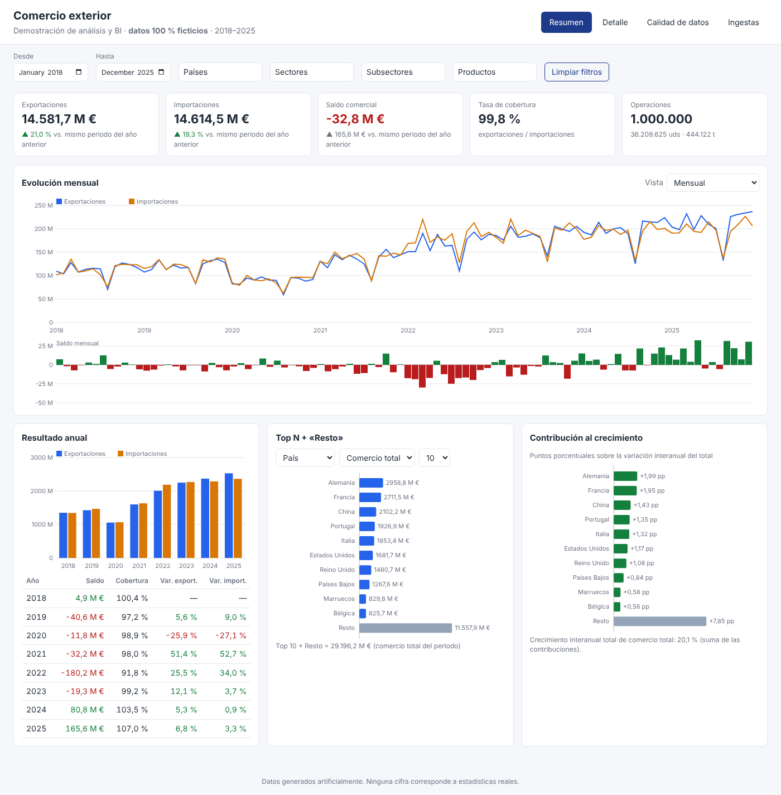

# Comercio exterior · aplicación de demostración de análisis de datos y BI

Aplicación completa, en local y con **datos 100 % ficticios**, que cubre el recorrido de un proyecto de datos:
generación de **1 millón de operaciones** (2018–2025, 50 países, 200 productos, sectores en dos niveles) → **lakehouse Parquet bronze/silver/gold** con cargas incrementales, duplicados, correcciones y registros inválidos → **motor analítico** con SQL ejecutable en DuckDB y versión compatible con Databricks → **API FastAPI** y **interfaz web** con indicadores, gráficos, tablas, filtros y exportación CSV, más pantallas de **calidad de datos** y **seguimiento de ingestas**.

No usa servicios externos, de pago ni credenciales.



## Puesta en marcha

Requiere Python ≥ 3.10.

```bash
cd comercio_exterior
pip install -r requirements.txt

# 1. Construir el lakehouse (≈ 90 s, genera ~62 MB en datos/lakehouse; ejecutarlo de nuevo no duplica nada)
PYTHONPATH=src python -m comercio_exterior.cli construir

# 2. Arrancar la API y la interfaz
PYTHONPATH=src python -m comercio_exterior.cli servir        # http://127.0.0.1:8000  ·  docs en /docs
```

Opciones útiles de `construir`: `--n 200000` (menos operaciones), `--entregas 28` y después `--desde-entrega 29` (carga incremental en dos tandas), `--particion anio`, `--limpiar`, `--guardar-verdad`.
Otros comandos: `exportar-sql` (regenera `sql/databricks/`).

### Pruebas

```bash
python -m pytest                     # 341 pruebas, ~85 s (usa un lakehouse de 60.000 operaciones que construye solo)
python -m pytest -m "not e2e"        # sin las pruebas con navegador
```

Las pruebas E2E usan Playwright y Chromium (se omiten si no están disponibles; con un Chromium ya instalado se localiza en `/opt/pw-browsers/chromium`).
Otros controles opcionales: `PYTHONPATH=src python scripts/benchmark.py` (rendimiento) y, con `pip install pyspark` y Java, `scripts/verificar_databricks_sql_spark.py` (SQL de Databricks en Spark local).

## Estructura

```
comercio_exterior/
├── src/comercio_exterior/
│   ├── catalogos.py          # 50 países, 200 productos, jerarquía de sectores, calendario
│   ├── simulacion.py         # 1 M de operaciones y entregas con duplicados, correcciones e inválidos
│   ├── lakehouse/            # pipeline bronze→silver→gold, registro de ingestas, calidad
│   ├── analitica/            # filtros validados, plantillas SQL, motor DuckDB, exportación a Databricks
│   ├── api/app.py            # FastAPI
│   ├── web/static/           # interfaz (HTML + JS + CSS, sin dependencias externas)
│   └── cli.py
├── sql/analitica/            # consultas (plantillas portables)      ├── sql/databricks/   # versión Databricks generada
├── notebooks/                # Databricks (no ejecutados en un workspace real)
├── scripts/                  # benchmark y verificación en Spark
├── tests/                    # unitarias, integración, referencia independiente, API, E2E
└── docs/                     # arquitectura, modelo de datos, métricas, API, Databricks, BI, rendimiento
```

El directorio también conserva la **demostración original** (50.000 registros): `generador.py`, `consultas.py`, `validaciones.py`, `demo.py`, `sql/0*.sql` y `notebooks/demo_databricks.py`.

## Documentación

| Documento | Contenido |
|---|---|
| [`docs/arquitectura.md`](docs/arquitectura.md) | capas, ingestas, idempotencia, tratamiento de duplicados/correcciones/rechazos, trazabilidad, decisiones y límites |
| [`docs/modelo_de_datos.md`](docs/modelo_de_datos.md) | catálogos, esquemas de bronze/silver/gold y control |
| [`docs/metricas.md`](docs/metricas.md) | fórmulas (saldo, cobertura, interanual, acumulados, cuotas, ranking, Top N + Resto, contribución) y casos límite |
| [`docs/api.md`](docs/api.md) | endpoints, filtros, errores y ejemplos |
| [`docs/databricks.md`](docs/databricks.md) | cómo trasladar las consultas; qué está probado |
| [`docs/bi.md`](docs/bi.md) | Power BI y Report Builder; **probado vs propuesto** |
| [`docs/rendimiento.md`](docs/rendimiento.md) | benchmarks sobre 1 M de filas, cuellos de botella y mejoras |

## Qué se ha verificado

- **Resultados**: las métricas (resumen, series mensual/anual con acumulados e interanual, tablas por 5 dimensiones, Top N + Resto con 4 medidas, contribución, ranking) se contrastan con una **implementación independiente en pandas** (`tests/referencia.py`) calculada a partir de la verdad del simulador, con 11 combinaciones de filtros. Esa comparación detectó un fallo real (ventanas actual/previa solapadas en rangos de más de 12 meses) que está corregido.
- **Invariantes**: Top N + «Resto» = total (4 medidas × 3 dimensiones × 3 valores de N × 2 sentidos); las contribuciones suman el crecimiento total; `bronze = silver + rechazados + descartes`; silver coincide exactamente con la verdad; gold coincide con una agregación independiente.
- **Cargas incrementales**: idempotentes (la misma ingesta, o el mismo contenido con otro identificador, se omite), reanudables tras un fallo en cada paso, y el estado se reconstruye idéntico desde bronze.
- **Casos límite**: división por cero, años y meses sin datos, saldos negativos, periodo previo vacío, filtros sin resultados, página fuera de rango.
- **Aplicación**: API (47 pruebas: validación, paginación, ordenación, CSV, errores) y E2E con Chromium (filtros, URL restaurable, tabla ordenable/paginada, descarga CSV, calidad, ingestas, estados vacíos y errores). La inestabilidad de una prueba E2E descubrió una condición de carrera real en la interfaz, corregida.
- **Databricks**: el SQL de `sql/databricks/` se ejecuta en Spark local con ANSI y coincide con DuckDB en 48 escenarios. **No** se ha probado en un workspace real.
- **Power BI / Report Builder**: **no probados**; solo se verificó el formato de las respuestas (ver `docs/bi.md`).

## Limitaciones

- Datos ficticios y simplificados: sin aranceles, divisas, series revisadas ni jerarquías reales; los importes están en `DOUBLE` con tolerancia de 0,01 €.
- Filtros de fecha por mes (gold es mensual). La comparación interanual desplaza el rango 12 meses; con rangos de más de un año las ventanas se solapan (documentado en `docs/metricas.md`).
- Un único escritor de ingestas (bloqueo por fichero); la API es de solo lectura, sin autenticación ni TLS: no exponerla fuera de local.
- Las correcciones en periodos antiguos reescriben trimestres completos (*copy-on-write*), que es el mayor coste de la carga.
- Rendimiento medido en una sola máquina de 4 vCPU; no hay pruebas de carga con muchos usuarios ni medidas en Databricks.
- La interfaz usa `<input type="month">`, cuyo aspecto depende del idioma del navegador.
